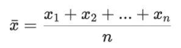
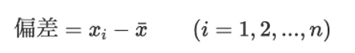
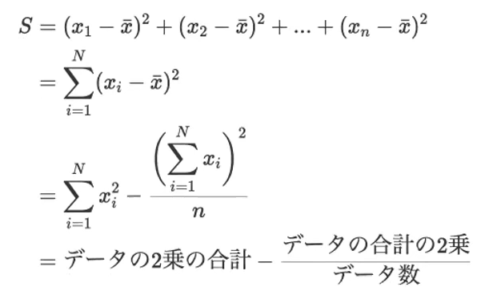
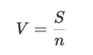
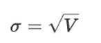
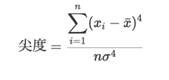
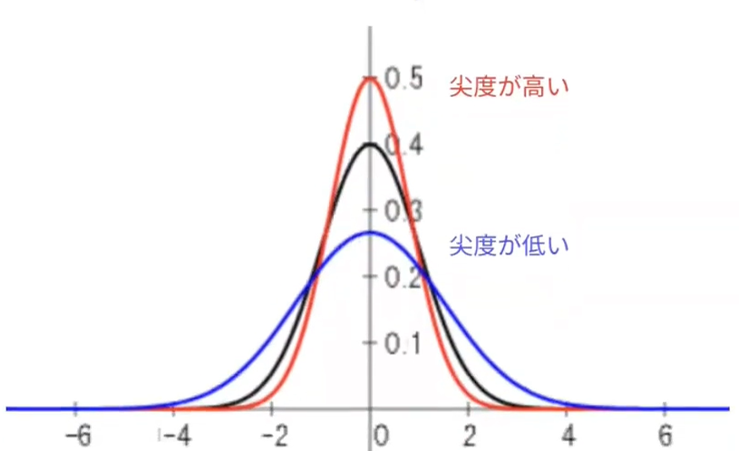
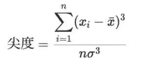
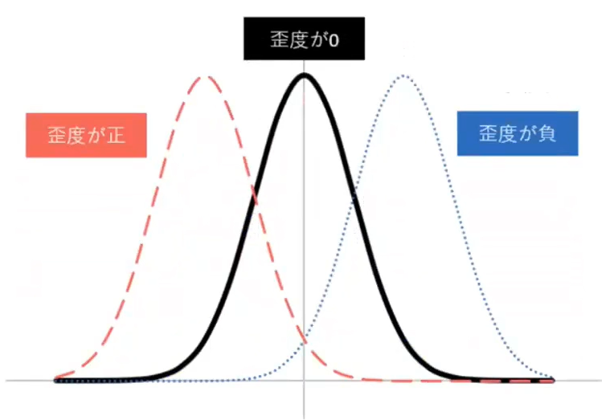

# 平均、偏差、平方和、分散、標準偏差

### 平均：全てのデータを足した値をデータ数で割った値

### 偏差：個々のデータと平均値との差
データのバラつきを表すが、正の値と負の値が存在する。

### 平方和：それぞれの偏差を2乗した値の和
正の値のみでバラつきを表せるが、データ数が増えると値が大きくなる。

### 分散：平方和をデータ数で割った値
データ数に依存せずにバラつきを表せるが、平均値と次元が異なる。

### 標準偏差：分散の正の平方根の値
平均値と同じ次元でバラつきを表せる。

## 尖度と歪度
データの分布をグラフに表した時に、平均値や分散などは分布の中心位置と広がり具合を著す統計量です。
その他にみ非対称や分布のとがり具合を表す統計量があります。

### 尖度：分布のとがり具合を表す
正規分布を3とし、3より大きければ正規分布より裾が短く、中央部がとがった分布になる。
逆に3より小ければ正規分布より裾が短く、中央部が丸まった分布になる。
※計算値から3を引いて、正規分布を0にする場合もある。

### 歪度：分布の非対称性を表す
分布の左側に山があるときに正、分布の右側に山があるときに負の値をとる。
左右対称の場合、0になる。

